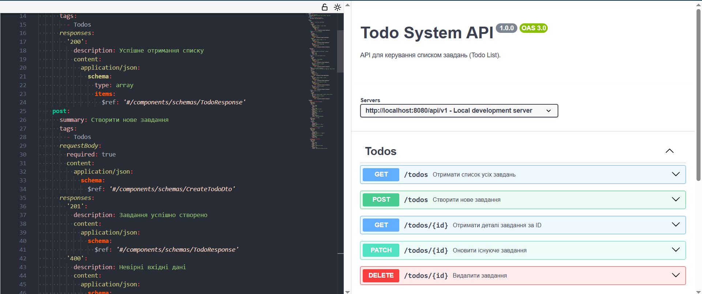

# ToDo System API


*(👆 Замініть посилання вище на ваш репозиторій: user/repo)*

Це REST API для системи керування завданнями (ToDo), реалізоване на Python (Flask). Проєкт розроблено поетапно з використанням архітектури Modular Monolith, практик Resilience, Docker та CI/CD.

---

## Архітектура та API Design

Було обрано архітектурний стиль **Modular Monolith** та підхід **Contract-First**.

### Документація
- **ADR (Архітектурні рішення):**
  - [0001 - Architecture Style](docs/adr/0001-architecture-style.md)
  - [0002 - Layered Architecture](docs/adr/0002-layered-architecture.md)
  - [0003 - API Style & Error Handling](docs/adr/0003-api-style-and-error-model.md)
- **API Контракт (OpenAPI/Swagger):** [docs/api/openapi.yaml](docs/api/openapi.yaml)

### Swagger UI (Попередній перегляд)


---

## Реалізація (Layered Architecture)

Код структуровано по шарах для забезпечення слабкої зв'язності:
- `src/api` — Контролери, DTO, Middleware.
- `src/service` — Бізнес-логіка.
- `src/domain` — Сутності.

**Запуск для розробки (без Docker):**
```bash
pip install -r requirements.txt
python -m src.app 
```

Docker

Проєкт запаковано у Docker-контейнер для ізольованого запуску.

**Збірка образу:**

docker build -t my-todo-app .


**Запуск контейнера:**

docker run -p 5000:5000 my-todo-app

Хост: http://localhost:5000

## CI/CD та Delivery

Налаштовано автоматизацію через GitHub Actions (.github/workflows/ci.yml).

Пайплайн виконує:

Checkout & Setup: Підготовка оточення.

Linting: Перевірка якості коду (flake8).

Tests: Запуск юніт-тестів.

Delivery (Artifact):

Використовується підхід Docker Save.

При успішному проходженні тестів збирається Docker-образ.

Образ експортується у .tar файл.

Завантажується як Artifact у GitHub Actions.

Як отримати образ (Delivery):

Відкрийте вкладку Actions у репозиторії GitHub.

Оберіть останній успішний запуск (Workflow run).

У секції Artifacts (внизу сторінки) завантажте файл docker-image.

Розгорніть його локально командою:

docker load < my-todo-image.tar